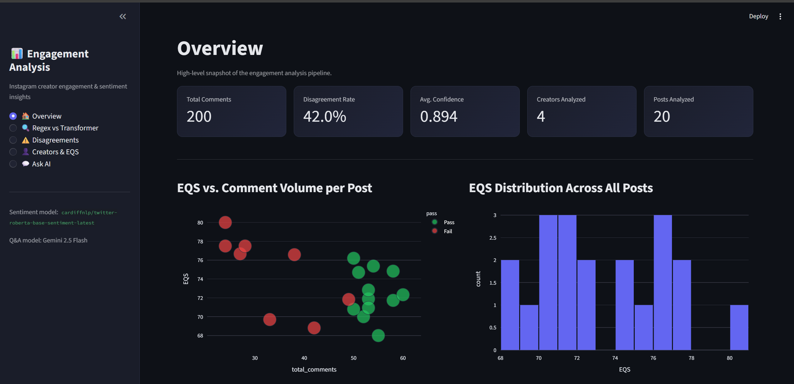
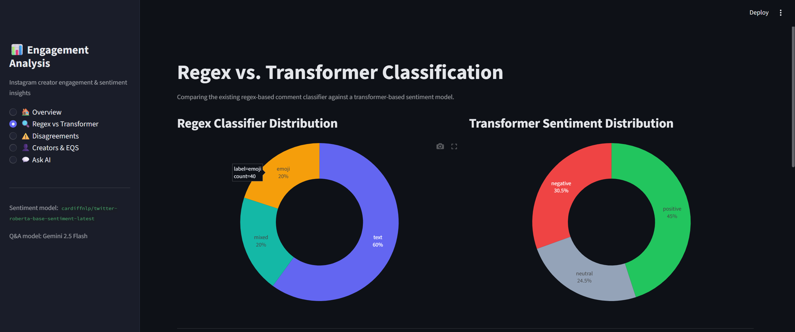
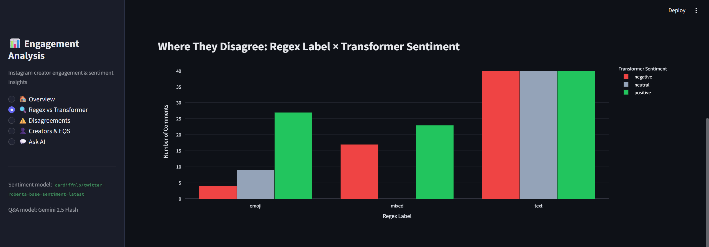
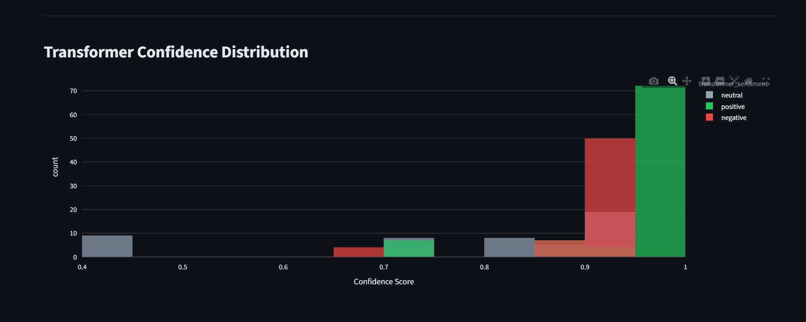
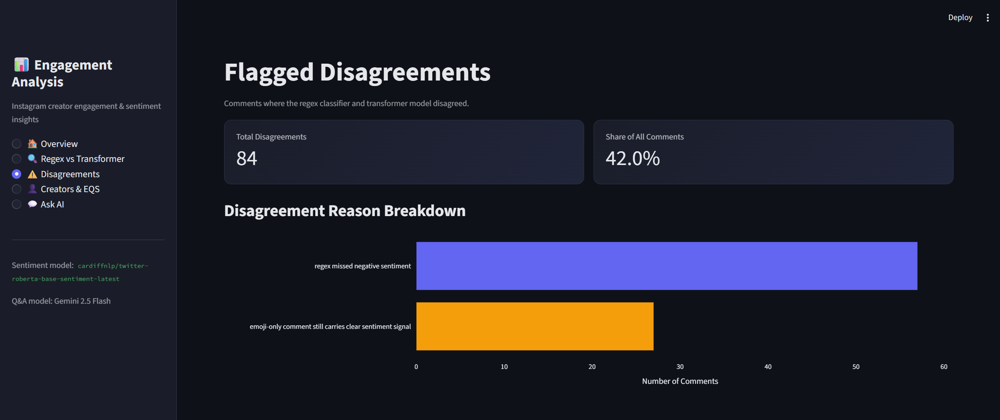
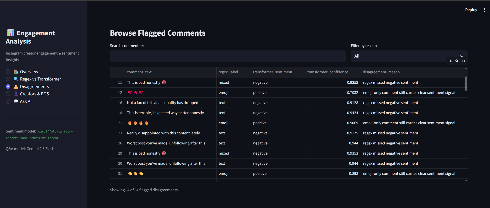
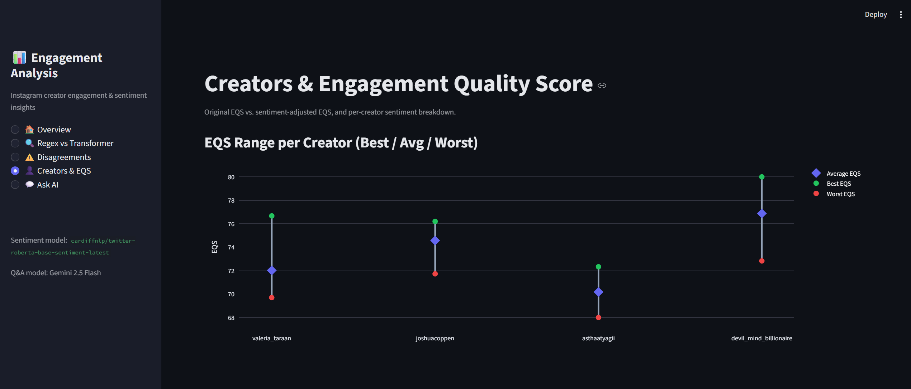
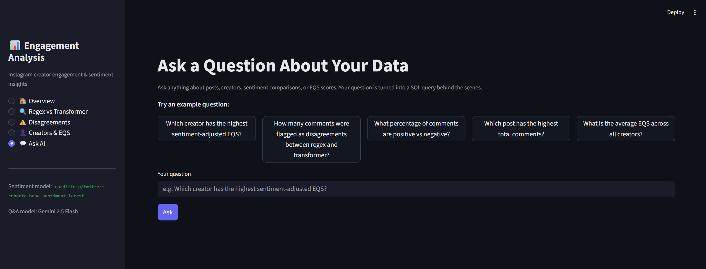
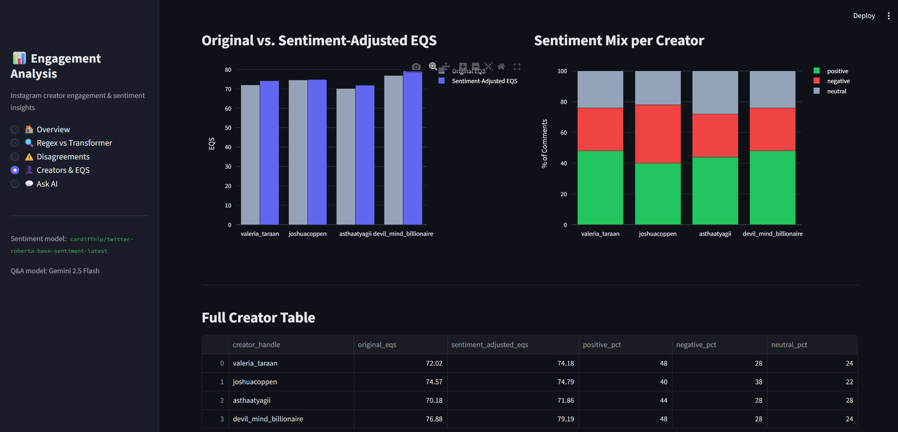

# Instagram Creator Analysis

A Python toolkit that scrapes Instagram posts and comments, scores creators on
**engagement quality**, layers on a transformer-based **sentiment** signal,
and serves everything through an interactive **Streamlit dashboard** with
natural-language Q&A powered by Gemini.

The project has three stages that build on each other:

| Stage | What it does | Key scripts |
|---|---|---|
| **1. Scraping** | Logs into Instagram, searches a keyword, collects posts, extracts comments | `src/scraper.py`, `src/creator_analyzer.py` |
| **2. Engagement scoring** | Classifies comments (text / emoji / mixed) and computes an Engagement Quality Score (EQS) per post and per creator | `src/comment_classifier.py`, `src/post_analyzer.py` |
| **3. Sentiment + GenAI layer** | Compares regex vs. transformer sentiment, builds a sentiment-adjusted EQS, loads everything into SQLite, and exposes a dashboard with LLM-powered Q&A | `src/sentiment_classifier.py`, `src/run_comparison.py`, `src/build_sentiment_eqs.py`, `src/db_setup.py`, `src/query_engine.py`, `dashboard.py` |

---

## How it works

### Stage 1 — Scraping (`scraper.py`)

1. Logs into Instagram with your credentials
2. Searches for a configured keyword (default: `"lifestyle"`)
3. Collects an initial batch of post URLs
4. Extracts comments from each post and classifies them as:
   - **Text** — letters/numbers, no emoji
   - **Emoji** — emoji only
   - **Mixed** — both
5. Flags a post as "high text-based engagement" if it has at least
   `minimum_comments_required` comments **and** at least
   `minimum_text_percentage_required`% of them are text-based
6. For every post that passes, opens the creator's profile and analyzes
   their latest `posts_per_creator` posts too
7. Writes `output/posts.csv` (post-level) and `output/creators.csv`
   (creator-level, aggregated)

### Engagement Quality Score (EQS)

```
EQS = (Text% × 0.6) + (Mixed% × 0.3) − (Emoji% × 0.1) + (Unique commenters ratio × 0.2)
```

- **Text% / Mixed% / Emoji%** — share of comments in each category
- **Unique commenters ratio** — unique commenters ÷ total comments (a proxy
  for how many distinct people engaged, vs. a few people commenting repeatedly)

### Stage 2 — Sentiment comparison and sentiment-adjusted EQS

- `sentiment_classifier.py` runs a transformer model
  (`cardiffnlp/twitter-roberta-base-sentiment-latest`) over the same comments
  the regex classifier already looked at, labeling each as positive /
  neutral / negative.
- `run_comparison.py` runs both classifiers on `output/raw_comments.csv`,
  flags cases where they disagree, and saves
  `output/comparison_results.csv`.
- `build_sentiment_eqs.py` aggregates sentiment percentages per creator and
  produces a sentiment-adjusted EQS, saved to
  `output/creators_with_sentiment_eqs.csv`. This is purely additive — it
  never touches `posts.csv` or `creators.csv`.

### Stage 3 — SQLite + natural-language Q&A

- `db_setup.py` loads every output CSV into a local SQLite database
  (`output/analytics.db`), one table per CSV. It's idempotent — rerunning it
  just drops and recreates the tables.
- `query_engine.py` implements a text-to-SQL RAG pipeline using the **Gemini API**
  (`gemini-2.5-flash`): it turns a plain-English question into SQL, validates
  the SQL is read-only/safe, runs it against `analytics.db`, and turns the
  result back into a plain-English answer.
- `dashboard.py` is a **Streamlit** app that ties everything together:
  charts for EQS and sentiment breakdowns, a regex-vs-transformer comparison
  view, and an "Ask AI" section backed by `query_engine.py`.

---

## Project structure

```
instragram_creator_analysis/
├── dashboard.py                  # Streamlit dashboard (entry point for Stage 3)
├── requirements.txt
├── config/
│   └── config.yaml               # Scraper + engagement settings
├── src/
│   ├── scraper.py                # Main scraping script (Stage 1)
│   ├── creator_analyzer.py       # Creator profile scraping
│   ├── comment_classifier.py     # Regex-based text/emoji/mixed classifier
│   ├── post_analyzer.py          # EQS + sentiment-adjusted EQS calculation
│   ├── sentiment_classifier.py   # Transformer-based sentiment model
│   ├── run_comparison.py         # Regex vs. transformer comparison
│   ├── build_sentiment_eqs.py    # Builds sentiment-adjusted EQS per creator
│   ├── db_setup.py               # Loads CSV outputs into SQLite
│   ├── query_engine.py           # Natural-language → SQL → answer (Gemini)
│   ├── utils.py                  # Shared helpers (config, driver, login, CSV I/O)
│   └── test_login.py             # Standalone Instagram login test/debug script
├── output/                       # Generated at runtime (not committed)
│   ├── posts.csv
│   ├── creators.csv
│   ├── raw_comments.csv
│   ├── comparison_results.csv
│   ├── creators_with_sentiment_eqs.csv
│   └── analytics.db
├── docs/
│   └── screenshots/               # Dashboard screenshots used in this README
├── QUICK_START.md
├── PHASE2_QUICKSTART.md
├── LOGIN_TROUBLESHOOTING.md
└── .env                           # Create this yourself — not committed
```

---

## Setup

### 1. Install dependencies

```bash
pip install -r requirements.txt
```

This includes Selenium (scraping), pandas/pyyaml (data + config),
transformers/torch (sentiment model), streamlit/plotly (dashboard), and
google-genai (Gemini Q&A).

### 2. Install ChromeDriver

Selenium needs a matching ChromeDriver on your `PATH`, plus Chrome itself
installed.

- **Windows**: download from https://chromedriver.chromium.org/, add to
  `PATH` or place next to the script
- **macOS**: `brew install chromedriver`
- **Linux**: `sudo apt-get install chromium-chromedriver`

### 3. Create a `.env` file

```
INSTAGRAM_USERNAME=your_username
INSTAGRAM_PASSWORD=your_password
GEMINI_API_KEY=your_gemini_api_key
```

`GEMINI_API_KEY` is only needed for the "Ask AI" Q&A feature in the
dashboard (`query_engine.py`); everything else works without it.

**Never commit `.env` to version control.**

Instagram credentials can alternatively be set under `login:` in
`config/config.yaml`, but `.env` is recommended.

### 4. Configure `config/config.yaml`

```yaml
keyword: "lifestyle"                       # keyword to search
number_of_initial_posts_to_scan: 10        # posts scanned in Stage 1
posts_per_creator: 5                       # posts analyzed per creator in Stage 2
minimum_comments_required: 50
minimum_text_percentage_required: 50
scroll_delay_range: [2, 4]

browser:
  headless: false                          # true hides the browser window
  slow_mode: 2                             # extra delay (seconds) to avoid detection

output:
  posts_csv: "output/posts.csv"
  creators_csv: "output/creators.csv"
```

---

## Running the pipeline

Run the stages in order — each one reads outputs the previous stage wrote.

```bash
# Stage 1 + 2: scrape Instagram, classify comments, compute EQS
cd src
python scraper.py

# Stage 3 (optional, adds sentiment + GenAI features):
python run_comparison.py         # regex vs. transformer sentiment
python build_sentiment_eqs.py    # sentiment-adjusted EQS per creator
python db_setup.py               # load CSVs into output/analytics.db

# Launch the dashboard (from the project root)
cd ..
streamlit run dashboard.py
```

If you only want the core scraper and EQS scores, running `scraper.py` alone
is enough — the sentiment/SQL/dashboard layer is entirely additive.

To debug login issues in isolation before running the full scraper:

```bash
cd src
python test_login.py
```

---

## Dashboard preview

The Streamlit dashboard (`dashboard.py`) has five pages, listed below with a
screenshot of each.

### Overview

High-level snapshot of the whole run: total comments, disagreement rate,
average transformer confidence, creators/posts analyzed, EQS vs. comment
volume, and the EQS distribution across all posts.



### Regex vs. Transformer

Side-by-side comparison of the original regex-based comment classifier
(text / emoji / mixed) against the transformer sentiment model's output
distribution (positive / neutral / negative).



Where the two methods land per regex label, broken down by transformer
sentiment:



Confidence scores from the transformer model — most predictions cluster
above 0.9:



### Disagreements

Summary of every case where the regex classifier and the transformer model
disagreed (42% of comments in this run), broken down by reason:



A searchable, filterable table of every flagged comment, with both labels
and the transformer's confidence score:



### Creators & EQS

Original EQS vs. sentiment-adjusted EQS per creator, each creator's
sentiment mix, the best/average/worst EQS range across their posts, and the
full underlying table:





### Ask AI

Natural-language Q&A over the SQLite database — questions are turned into
SQL by Gemini, validated as read-only, executed, and answered in plain
English.



---

## Output files

### `posts.csv` (one row per post)

| Column | Description |
|---|---|
| `creator_handle` | Instagram handle of the post's creator |
| `post_url` | Full post URL |
| `total_comments` | Number of comments extracted |
| `text_percentage` / `emoji_percentage` / `mixed_percentage` | Comment classification breakdown |
| `unique_commenters_ratio` | Unique commenters ÷ total comments |
| `EQS` | Engagement Quality Score |
| `pass` | `"Pass"` / `"Fail"` against the configured engagement criteria |

### `creators.csv` (one row per creator)

| Column | Description |
|---|---|
| `creator_handle` | Instagram handle |
| `posts_analyzed` / `posts_passed` | Counts across the creator's analyzed posts |
| `avg_text_percentage` / `avg_emoji_percentage` / `avg_mixed_percentage` | Averages across posts |
| `avg_EQS` / `best_EQS` / `worst_EQS` | EQS summary stats |

### `comparison_results.csv` (one row per comment)

Regex classification, transformer sentiment + confidence, and a flag for
where the two approaches disagree.

### `creators_with_sentiment_eqs.csv` (one row per creator)

`creators.csv` joined with aggregated sentiment percentages and a
sentiment-adjusted EQS.

### `analytics.db`

SQLite database with one table per CSV above (`posts`, `creators`,
`comparison_results`, `creators_with_sentiment_eqs`), used by the
dashboard's natural-language Q&A.

---

## Logging & error handling

- Every run logs to both the console and `instagram_scraper.log`
  (timestamp, level, message)
- Selenium operations use multiple fallback selectors and retry logic
- On error, the scraper saves a screenshot and page source for debugging
  (see the `login_error_*.png` files in `src/` as examples)
- Progress bars (`tqdm`) show live progress through Stage 1 and Stage 2

---

## Troubleshooting

**Rate limits / blocked requests**
- Increase `browser.slow_mode` in `config.yaml` (try 5–10 seconds)
- Reduce `number_of_initial_posts_to_scan` and `posts_per_creator`
- Wait a while before retrying if temporarily blocked

**Login issues**
- Run `python src/test_login.py` in isolation first
- Double-check `.env` values
- Inspect the generated `login_error_*.png` screenshots and page source
- See `LOGIN_TROUBLESHOOTING.md` for a fuller walkthrough

**Slow loading / timeouts**
- Check your connection and Chrome/ChromeDriver version match
- Run with `browser.headless: false` to watch what's happening
- Reduce the number of posts processed per run

See `QUICK_START.md` and `PHASE2_QUICKSTART.md` for additional walkthroughs.

---

## Notes & limitations

- Instagram's UI changes often; Selenium selectors may need updates over time
- Anti-detection delays are built in, but rate limiting can still happen
- `unique_commenters_ratio` is approximated from unique comment text rather
  than parsed usernames
- `query_engine.py` validates generated SQL is read-only before executing it
  against `analytics.db`, but treat the Gemini API key like any other secret
- For production-scale or long-term use, prefer Instagram's official API
  over scraping

## Dependencies

- `selenium` — browser automation
- `python-dotenv` — environment variable loading
- `pyyaml` — config parsing
- `pandas` — CSV/data handling
- `tqdm` — progress bars
- `transformers`, `torch` — transformer sentiment model
- `streamlit`, `plotly` — dashboard and charts
- `google-genai` — Gemini API client for natural-language Q&A

## License

This project is for educational purposes. Use responsibly and in compliance
with Instagram's Terms of Service.
